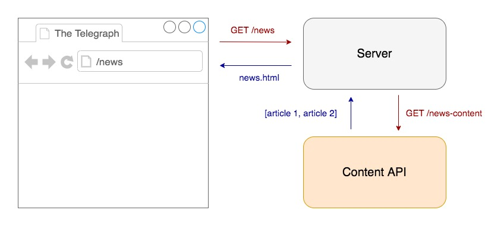
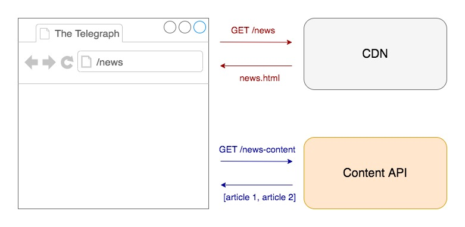
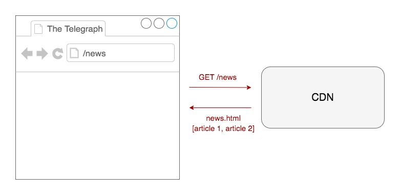

# Sapper/Svelte

## Objectives

Unlike Nuxt and Preact, Svelte is not a framework - it's a compiler step so it runs at build time. This is helpful as the code is compiled to native technologies, meaning there is no overhead for the user in terms of shipping a framework.

By default Svelte doesn't support routing and static rendering. Sapper is powered by Svelte and handles a lot of PWA characteristics such as offline support and service workers out of the box. It also takes care of static routing and also supports server-side rendering.

## POC

Project repo: [https://github.com/chrisboakes/svelte-sapper-demo](https://github.com/chrisboakes/svelte-sapper-demo)

Built project: [https://svelte-sapper-demo.herokuapp.com/](https://svelte-sapper-demo.herokuapp.com/)

I used the default [sapper-template](https://github.com/sveltejs/sapper-template) to rapidly prototype this POC and used some dummy data to imitate the content API (e.g. [news articles](https://my-json-server.typicode.com/chrisboakes/svelte-sapper-demo/news-articles)).

This POC is a mixture of statically generated, server-side rendered and client side rendered data:

- [Static rendering](#Static-Rendering): the home page and the politics articles
- [Server-side rendering](#Server-Side-Rendering): the politics page and the single news articles
- [Client-side rendering](#Client-Side-Rendering): the data on the news page

## Outcome

### Pros

- Static build was fast (260ms)
- Intuitive architecture not disimilar to frameworks such as React and Vue
- No overhead of a loading a framework for the end user - the code is compiled
- Has offline support and a configured service worker out of the box
- Integrates well with frequent, real time updates

### Cons

- Cannot seem to run a separate build job to statically render *just* new articles when they are modified or created (instead of the entire application every time there is a new article)
- New technology so while there is some support online, it's not as widely supported as React
- Unsure about data binding when content is updated via service worker

## Further research

- Gain a greater understanding of how the out of the box features work:
	- Server workers and how the data binding works when content is updated
	- DOM hydration
	- Pre-fetching
- Sharing of `[slug].svelte` template
- Load test build time based on quantity of articles

## Resources

- [Sapper Introduction](https://svelte.dev/blog/sapper-towards-the-ideal-web-app-framework)
- [Svelte Docs](https://svelte.dev/)
- [Sapper Docs](https://sapper.svelte.dev/)

## Rendering Types

[This article](https://developers.google.com/web/updates/2019/02/rendering-on-the-web) gives an overview of the different rendering types.

### Server-Side Rendering

The request is made to the server which makes a call to the Content API, once it has a response it returns the data to the server and the server returns the HTML to the browser.



### Client-Side Rendering

The intial request for HTML is made to the CDN which returns HTML without any content. After the HTML has been rendered by the browser a call is made via JavaScript to fetch the content from the content API which is then appended into the markup.



### Static Rendering

Before the application is deployed, when the project is being compiled, all of the requests to the content API are made and compiled to HTML files which can served back quickly from a CDN.



# Running the project

However you get the code, you can install dependencies and run the project in development mode with:

```bash
cd my-app
npm install # or yarn
npm run dev
```

Open up [localhost:3000](http://localhost:3000) and start clicking around.

Consult [sapper.svelte.dev](https://sapper.svelte.dev) for help getting started.


## Structure

Sapper expects to find two directories in the root of your project —  `src` and `static`.


### src

The [src](src) directory contains the entry points for your app — `client.js`, `server.js` and (optionally) a `service-worker.js` — along with a `template.html` file and a `routes` directory.


#### src/routes

This is the heart of your Sapper app. There are two kinds of routes — *pages*, and *server routes*.

**Pages** are Svelte components written in `.svelte` files. When a user first visits the application, they will be served a server-rendered version of the route in question, plus some JavaScript that 'hydrates' the page and initialises a client-side router. From that point forward, navigating to other pages is handled entirely on the client for a fast, app-like feel. (Sapper will preload and cache the code for these subsequent pages, so that navigation is instantaneous.)

**Server routes** are modules written in `.js` files, that export functions corresponding to HTTP methods. Each function receives Express `request` and `response` objects as arguments, plus a `next` function. This is useful for creating a JSON API, for example.

There are three simple rules for naming the files that define your routes:

* A file called `src/routes/about.svelte` corresponds to the `/about` route. A file called `src/routes/blog/[slug].svelte` corresponds to the `/blog/:slug` route, in which case `params.slug` is available to the route
* The file `src/routes/index.svelte` (or `src/routes/index.js`) corresponds to the root of your app. `src/routes/about/index.svelte` is treated the same as `src/routes/about.svelte`.
* Files and directories with a leading underscore do *not* create routes. This allows you to colocate helper modules and components with the routes that depend on them — for example you could have a file called `src/routes/_helpers/datetime.js` and it would *not* create a `/_helpers/datetime` route


### static

The [static](static) directory contains any static assets that should be available. These are served using [sirv](https://github.com/lukeed/sirv).

In your [service-worker.js](src/service-worker.js) file, you can import these as `files` from the generated manifest...

```js
import { files } from '@sapper/service-worker';
```

...so that you can cache them (though you can choose not to, for example if you don't want to cache very large files).


## Bundler config

Sapper uses Rollup or webpack to provide code-splitting and dynamic imports, as well as compiling your Svelte components. With webpack, it also provides hot module reloading. As long as you don't do anything daft, you can edit the configuration files to add whatever plugins you'd like.


## Production mode and deployment

To start a production version of your app, run `npm run build && npm start`. This will disable live reloading, and activate the appropriate bundler plugins.

You can deploy your application to any environment that supports Node 10 or above. As an example, to deploy to [ZEIT Now](https://zeit.co/now) when using `sapper export`, run these commands:

```bash
npm install -g now
now
```

If your app can't be exported to a static site, you can use the [now-sapper](https://github.com/thgh/now-sapper) builder. You can find instructions on how to do so in its [README](https://github.com/thgh/now-sapper#basic-usage).


## Using external components

When using Svelte components installed from npm, such as [@sveltejs/svelte-virtual-list](https://github.com/sveltejs/svelte-virtual-list), Svelte needs the original component source (rather than any precompiled JavaScript that ships with the component). This allows the component to be rendered server-side, and also keeps your client-side app smaller.

Because of that, it's essential that the bundler doesn't treat the package as an *external dependency*. You can either modify the `external` option under `server` in [rollup.config.js](rollup.config.js) or the `externals` option in [webpack.config.js](webpack.config.js), or simply install the package to `devDependencies` rather than `dependencies`, which will cause it to get bundled (and therefore compiled) with your app:

```bash
npm install -D @sveltejs/svelte-virtual-list
```


## Bugs and feedback

Sapper is in early development, and may have the odd rough edge here and there. Please be vocal over on the [Sapper issue tracker](https://github.com/sveltejs/sapper/issues).
